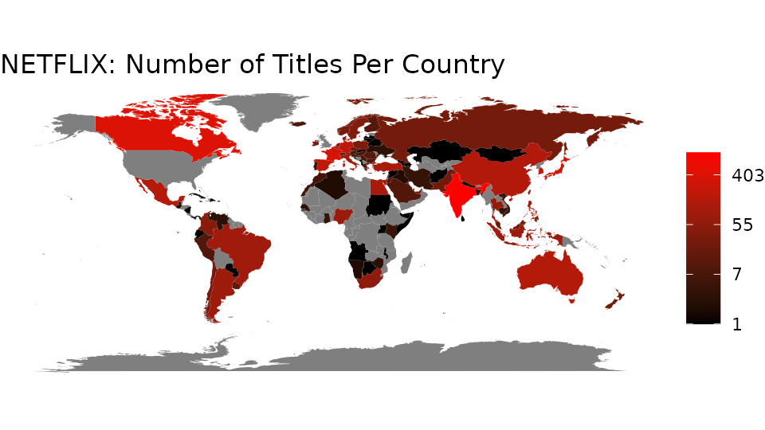

Netflix Titles
================

分析例

  - 月あたりの新作件数
  - 国あたりの作品件数

簡単のため同名別作品は区別しないものとする。

# Load Data

``` r
# CSVファイルのダウンロードと読み込み
# pinsパッケージを使ってキャッシュしておく
csv <- file.path(
  "https://raw.githubusercontent.com/rfordatascience/tidytuesday",
  "master/data/2021/2021-04-20/netflix_titles.csv"
)
board <- pins::board_url(c(netflix = csv))
netflix <- readr::read_csv(
  pins::pin_download(board, 'netflix'),
  show_col_types = FALSE
)

# 確認
dplyr::glimpse(netflix)
```

    ## Rows: 7,787
    ## Columns: 12
    ## $ show_id      <chr> "s1", "s2", "s3", "s4", "s5", "s6", "s7", "s8", "s9", "s1…
    ## $ type         <chr> "TV Show", "Movie", "Movie", "Movie", "Movie", "TV Show",…
    ## $ title        <chr> "3%", "7:19", "23:59", "9", "21", "46", "122", "187", "70…
    ## $ director     <chr> NA, "Jorge Michel Grau", "Gilbert Chan", "Shane Acker", "…
    ## $ cast         <chr> "João Miguel, Bianca Comparato, Michel Gomes, Rodolfo Val…
    ## $ country      <chr> "Brazil", "Mexico", "Singapore", "United States", "United…
    ## $ date_added   <chr> "August 14, 2020", "December 23, 2016", "December 20, 201…
    ## $ release_year <dbl> 2020, 2016, 2011, 2009, 2008, 2016, 2019, 1997, 2019, 200…
    ## $ rating       <chr> "TV-MA", "TV-MA", "R", "PG-13", "PG-13", "TV-MA", "TV-MA"…
    ## $ duration     <chr> "4 Seasons", "93 min", "78 min", "80 min", "123 min", "1 …
    ## $ listed_in    <chr> "International TV Shows, TV Dramas, TV Sci-Fi & Fantasy",…
    ## $ description  <chr> "In a future where the elite inhabit an island paradise f…

# Number of New Titles Per Month

## 集計

``` r
added_per_month <- netflix |>
  # タイトルと追加した月を抽出
  dplyr::transmute(
    title,
    month_added = date_added |>
      lubridate::mdy() |>                   # 文字列をDateに変換
      lubridate::floor_date(unit = "month") # 月ごとに集計するため日付を1日に変更
  ) |>
  # titleごとにmonth_addedの最小値を集計
  dplyr::group_by(title) |>
  dplyr::summarize(month_added = min(month_added)) |>
  # 月ごとに行数をカウント
  dplyr::count(month_added)

dplyr::glimpse(added_per_month)
```

    ## Rows: 101
    ## Columns: 2
    ## $ month_added <date> 2008-01-01, 2008-02-01, 2009-05-01, 2009-11-01, 2010-11-0…
    ## $ n           <int> 1, 1, 1, 1, 1, 1, 1, 11, 1, 1, 1, 1, 1, 2, 3, 2, 2, 2, 2, …

## 可視化

``` r
ggplot2::ggplot(added_per_month) +
  # 高さ1の棒グラフを使い色で件数を表現
  ggplot2::geom_col(ggplot2::aes(x = month_added, y = 1, fill = n)) +
  # NETFLIXと白字で記述
  ggplot2::annotate(
    "text", label = "NETFLIX", color = "white", size = 20,
    x = as.Date(-Inf), y = Inf, hjust = -0.01, vjust = 1.1
  ) +
  # 棒グラフの色を調整
  ggplot2::scale_fill_gradient(
    name = NULL,                 # 凡例のタイトルは不要
    low = "black", high = "red", # NETFLIXカラーにする
    limits = c(0L, NA_integer_)  # 最小値を0に固定、最大値をデータから決定
  ) +
  # タイトル追加
  ggplot2::labs(title = "Number of New Titles Per Month") +
  # 見た目をシンプルにする
  ggplot2::coord_cartesian(expand = FALSE) + # 不要な余白を除去
  ggplot2::theme_minimal() +
  ggplot2::theme(
    panel.background = ggplot2::element_rect(
      fill = "black" # 0件の部分は棒がないので黒塗り
    ),
    panel.grid = ggplot2::element_blank(), # 目盛線不要
    axis.title = ggplot2::element_blank(), # 軸タイトル不要
    axis.text.y = ggplot2::element_blank() # 今回はy軸の値に意味がないので省略
  )
```

<!-- -->

# Number of Titles Per Country

## 集計

``` r
titles_per_country <- netflix |>
  # タイトルと国ごとに1行ずつ抽出
  dplyr::group_by(title, country) |>
  dplyr::slice(1L) |>
  # 国ごとに行数をカウント
  dplyr::group_by(country) |>
  dplyr::count()

dplyr::glimpse(titles_per_country)
```

    ## Rows: 682
    ## Columns: 2
    ## Groups: country [682]
    ## $ country <chr> "Argentina", "Argentina, Brazil, France, Poland, Germany, Denm…
    ## $ n       <int> 50, 1, 1, 1, 1, 1, 1, 8, 1, 1, 1, 1, 83, 1, 2, 1, 1, 1, 1, 1, …

`country`列には`"Argentina, Brazil, France, Poland, Germany,
Denmark"`などと、カンマ区切りで複数の国が記録されている点に注意。

## 地図データとのマージ

地図データ読み込み。

`region`列が集計結果の`country`列に相当する。

``` r
world <- ggplot2::map_data("world")
dplyr::glimpse(world)
```

    ## Rows: 99,338
    ## Columns: 6
    ## $ long      <dbl> -69.89912, -69.89571, -69.94219, -70.00415, -70.06612, -70.0…
    ## $ lat       <dbl> 12.45200, 12.42300, 12.43853, 12.50049, 12.54697, 12.59707, …
    ## $ group     <dbl> 1, 1, 1, 1, 1, 1, 1, 1, 1, 1, 2, 2, 2, 2, 2, 2, 2, 2, 2, 2, …
    ## $ order     <int> 1, 2, 3, 4, 5, 6, 7, 8, 9, 10, 12, 13, 14, 15, 16, 17, 18, 1…
    ## $ region    <chr> "Aruba", "Aruba", "Aruba", "Aruba", "Aruba", "Aruba", "Aruba…
    ## $ subregion <chr> NA, NA, NA, NA, NA, NA, NA, NA, NA, NA, NA, NA, NA, NA, NA, …

集計結果と地図データのマージ。

地図に合わせて集計結果の`country`列を整形し、再集計してからマージする。

``` r
titles_per_region <- titles_per_country |>
  # country列をregion列に改名
  dplyr::rename(region = country) |>
  # 1行あたりにカンマ区切りで複数の国名が入っているので行方向に分割
  tidyr::separate_rows("region", sep = ", ") |>
  # 分割で生じた国名の重複を解消するため、国名ごとにタイトル数の和を集計
  dplyr::group_by(region) |>
  dplyr::summarize(n = sum(n)) |>
  # 地図データとマージ
  dplyr::right_join(world, by = "region")

dplyr::glimpse(titles_per_region)
```

    ## Rows: 99,338
    ## Columns: 7
    ## $ region    <chr> "Afghanistan", "Afghanistan", "Afghanistan", "Afghanistan", …
    ## $ n         <int> 1, 1, 1, 1, 1, 1, 1, 1, 1, 1, 1, 1, 1, 1, 1, 1, 1, 1, 1, 1, …
    ## $ long      <dbl> 74.89131, 74.84023, 74.76738, 74.73896, 74.72666, 74.66895, …
    ## $ lat       <dbl> 37.23164, 37.22505, 37.24917, 37.28564, 37.29072, 37.26670, …
    ## $ group     <dbl> 2, 2, 2, 2, 2, 2, 2, 2, 2, 2, 2, 2, 2, 2, 2, 2, 2, 2, 2, 2, …
    ## $ order     <int> 12, 13, 14, 15, 16, 17, 18, 19, 20, 21, 22, 23, 24, 25, 26, …
    ## $ subregion <chr> NA, NA, NA, NA, NA, NA, NA, NA, NA, NA, NA, NA, NA, NA, NA, …

## 可視化

``` r
ggplot2::ggplot(titles_per_region) +
  # 地図の表示。国をタイトル数で塗り潰す
  ggplot2::geom_map(
    ggplot2::aes(long, lat, map_id = region, fill = n),
    map = world
  ) +
  # 国ごとの色の塗り方を調整
  ggplot2::scale_fill_gradient(
    name = NULL,                 # 凡例のタイトルは不要
    low = "black", high = "red", # NETFLIXカラー化
    trans = "log",               # 件数のレンジが広いので対数をとる
    limits = c(1L, NA_integer_), # 最小値を1件にする
    label = round                # 凡例の数値を整数に丸める
  ) +
  # タイトルの追加
  ggplot2::labs(title = "NETFLIX: Number of Titles Per Country") +
  # 地図なので縦横比を揃える
  ggplot2::coord_equal() +
  # 見た目をシンプルにする
  ggplot2::theme_void()
```

<!-- -->
