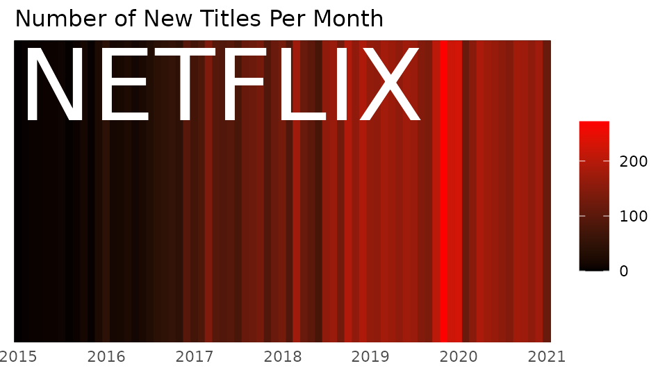

Tidy Tuesday (ver. Japan.R 2021)
================

  - tidyverseのパッケージ群を用いたデータ処理や可視化に慣れ親しむイベント……のJapan.R版
  - [本家](https://twitter.com/hashtag/tidytuesday)では週替わりのデータをテーマに参加者各位がTwitter上で成果を共有中
  - 今回はJapan.R 2021運営メンバーで企画し、グループワークとして実施

参加登録は <https://japanr.connpass.com/event/230722/> から。

## お題: Netflix titles

Zoomのブレイクアウトルームで仲間と共に分析しよう

  - 過去にNetflixで公開されたMovieやTV Showに関するデータセット
  - ネタに困ったら[Issue](https://github.com/atusy/tidytuesday-netflix/labels/Tidy%20Tuesday)へGO\!
  - 成果はTwitter [\#JapanR](https://twitter.com/hashtag/JapanR?f=live)
    で共有しよう
      - 誹謗中傷やハラスメントはダメゼッタイ

| 列名            | 型         | 概要                                                                                                          |
| :------------ | :-------- | :---------------------------------------------------------------------------------------------------------- |
| show\_id      | character | 固有ID。行ごとに値が異なる                                                                                              |
| type          | character | “Movie”または“TV Show”                                                                                         |
| title         | character | タイトル                                                                                                        |
| director      | character | 監督                                                                                                          |
| cast          | character | 出演者（カンマ区切り）                                                                                                 |
| country       | character | 国（カンマ区切り）                                                                                                   |
| date\_added   | character | Netflixに追加された日                                                                                              |
| release\_year | double    | 実際の公開年                                                                                                      |
| rating        | character | 対象年齢のレーティング（[参考](https://www.primevideo.com/help/ref=atv_hp_nd_nav?language=ja_JP&nodeId=GFGQU3WYEG6FSJFJ)） |
| duration      | character | 長さ・期間など                                                                                                     |
| listed\_in    | character | ジャンル（カンマ区切り）                                                                                                |
| description   | character | 概要                                                                                                          |

### 入手方法

``` r
readr::read_csv(
  file.path(
    "https://raw.githubusercontent.com/rfordatascience/tidytuesday",
    "master/data/2021/2021-04-20/netflix_titles.csv"
  ),
  show_col_types = FALSE
)
```

### 分析例

#### Twitter

Search: [\#tidytuesday
netflix](https://twitter.com/search?q=%23tidytuesday%20netflix&src=typed_query&f=top)

#### By Atusy

コードは [README.md](README.md) を参照

<!-- --><!-- -->

## ENJOY\!

終了後はJapan.R本編開始までDiscordで感想戦しましょう！
